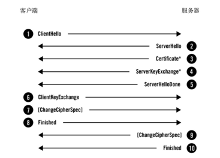

#iOS中的HTTP/HTTPS授权访问（二）
##背景
在网络请求中有http和https请求两种,两者的解释可以通过Google去了解下,这里不再做过多的描述.大致说一下https,这是http请求的升级版,具有良好的加密功能,在客户端向服务端发起https请求时需要进行一系列的处理,过程如下:



第一步:客户端向服务端发起https请求(图中1).

第二步:从图中可以看出这个阶段包含4个过程(图中2,3,4,5)有的服务端是单条发送,有的是合并一起发送.服务端返回协商的信息结果,包括选择使用的协议版本,选择的加密套件,选择的压缩算法、随机数random_S等,其中随机数用于后续的密钥协商。服务器也会配置并返回对应的证书链Certificate，用于身份验证与密钥交换.然后会发送ServerHelloDone信息用于通知客户端信息发送结束(这里在上一篇文章中说到的delegate会被调用)。

第三步:这一步是由客户端收到服务端返回的信息后要进行解析,校验,在通过校验后需要返回给服务端一个带有证书加密的随机值(图中6,7,8),这个随机值的作用就是让服务端和客户端建立一条由这个随机值建立的秘密通道,以后所有的信息都在这条秘密通道中传输,并且用这个随机值来进行加解密(图中9,10).

如果看过AFNetworking的话都知道它把服务端返回的权限认证做了如下处理:

```objective-c
- (void)URLSession:(NSURLSession *)session
didReceiveChallenge:(NSURLAuthenticationChallenge *)challenge
 completionHandler:(void (^)(NSURLSessionAuthChallengeDisposition disposition, NSURLCredential *credential))completionHandler
{
    //权限处理类型为 默认
    /*
     NSURLSessionAuthChallengePerformDefaultHandling：默认方式处理
     NSURLSessionAuthChallengeUseCredential：使用指定的证书
     NSURLSessionAuthChallengeCancelAuthenticationChallenge：取消权限认证
     */
    NSURLSessionAuthChallengeDisposition disposition = NSURLSessionAuthChallengePerformDefaultHandling;
    __block NSURLCredential *credential = nil;

    // sessionDidReceiveAuthenticationChallenge是自定义方法，用来如何应对服务器端的认证挑战

    if (self.sessionDidReceiveAuthenticationChallenge) {
        disposition = self.sessionDidReceiveAuthenticationChallenge(session, challenge, &credential);
    } else {
    NSURLAuthenticationMethodServerTrust
        if ([challenge.protectionSpace.authenticationMethod isEqualToString:NSURLAuthenticationMethodServerTrust]) {
            if ([self.securityPolicy evaluateServerTrust:challenge.protectionSpace.serverTrust forDomain:challenge.protectionSpace.host]) {
                credential = [NSURLCredential credentialForTrust:challenge.protectionSpace.serverTrust];
                if (credential) {
                    disposition = NSURLSessionAuthChallengeUseCredential;
                } else {
                    disposition = NSURLSessionAuthChallengePerformDefaultHandling;
                }
            } else {
                disposition = NSURLSessionAuthChallengeCancelAuthenticationChallenge;
            }
        } else {
            disposition = NSURLSessionAuthChallengePerformDefaultHandling;
        }
    }
    if (completionHandler) {
        completionHandler(disposition, credential);
    }
}
```

整段代码的重点在于`[self.securityPolicy evaluateServerTrust:challenge.protectionSpace.serverTrust forDomain:challenge.protectionSpace.host]`这个self.securityPolicy是`AFSecurityPolicy`类,它将https请求的验证做了一个封装,那么如果没有这个封装,或者我们在使用NSURLSession的时候应该怎么处理呢？

如果是https请求的话`challenge.protectionSpace.authenticationMethod`肯定是NSURLAuthenticationMethodServerTrust这个字段,那么一般情况下我们需要做如下处理:

```objective-c
	//1
    SecTrustRef trust = challenge.protectionSpace.serverTrust;
    SecTrustResultType resultType;
    NSURLCredential *credential = nil;
    NSURLSessionAuthChallengeDisposition disposition = NSURLSessionAuthChallengePerformDefaultHandling;
    //2
    OSStatus status = SecTrustEvaluate(trust, &result);
    //3
    if (status == errSecSuccess &&
        (result == kSecTrustResultProceed ||
         result == kSecTrustResultUnspecified))
    {
        credential = [NSURLCredential credentialForTrust:trust];
        if (credential)
        {
            disposition = NSURLSessionAuthChallengeUseCredential;
        }
        else
        {
            disposition = NSURLSessionAuthChallengePerformDefaultHandling;
        }
    }
    else
    {
        disposition = NSURLSessionAuthChallengeCancelAuthenticationChallenge;
    }
    //4
    if (completionHandler) {
        completionHandler(disposition, credential);
    }
```

详解如下:

1.我们根据`challenge.protectionSpace.serverTrust`创建一个`SecTrustRef`对象以及后面要用到的鉴定结果类型`resultType`,证书凭证`credential`,后续处理方法`disposition`.

2.使用证书校验方法`SecTrustEvaluate(serverTrust对象,校验结果)`对服务端返回的`serverTrust`进行校验并且返回校验结果`status`.

3.对返回值进行处理,如果满足条件则使用`serverTrust`创建`credential`.

4.将`credential`以及`disposition`回传给服务器.

在HTTP/HTTPS授权访问（一）中已经对`NSURLCredential`,`NSURLSessionAuthChallengeDisposition`做了详细的介绍,这里主要说下以下几个:

###SecTrustRef
这是一个需要验证的信任对象,包含待验证的证书和支持的验证方法等.

###SecTrustResultType
表示验证结果。其中 kSecTrustResultProceed表示serverTrust验证成功，且该验证得到了用户认可(例如在弹出的是否信任的alert框中选择always trust)。 kSecTrustResultUnspecified表示 serverTrust验证成功，此证书也被暗中信任了，但是用户并没有显示地决定信任该证书。 两者取其一就可以认为对serverTrust验证成功。

###SecTrustEvaluate
证书校验函数,在函数的内部递归地从叶节点证书到根证书验证。需要验证证书本身的合法性（验证签名完整性，验证证书有效期等);验证证书颁发者的合法性（查找颁发者的证书并检查其合法性，这个过程是递归的).而递归的终止条件是证书验证过程中遇到了锚点证书(锚点证书:嵌入到操作系统中的根证书,这个根证书是权威证书颁发机构颁发的自签名证书).

上面所说的只是一般的校验方法,那么在有的客户端中,为了确定服务端返回的证书是否是自己所需要的证书,这时我们需要在客户端中导入本地证书.整个过程代码如下:

```objective-c
    //本地导入证书
    NSString *path = @"证书路径";
    NSData *certificateData = [NSData dataWithContentsOfFile:path];
    SecCertificateRef certificate = SecCertificateCreateWithData(NULL, (__bridge CFDataRef)certificateData);
    NSArray *certificateArray = @[CFBridgingRelease(certificate)];
    
    SecTrustRef trust = challenge.protectionSpace.serverTrust;
    SecTrustResultType result;
    NSURLCredential *credential = nil;
    NSURLSessionAuthChallengeDisposition disposition = NSURLSessionAuthChallengePerformDefaultHandling;
    
    SecTrustSetAnchorCertificates(trust, (__bridge CFArrayRef)certificateArray);
    
    OSStatus status = SecTrustEvaluate(trust, &result);
    if (status == errSecSuccess &&
        (result == kSecTrustResultProceed ||
         result == kSecTrustResultUnspecified))
    {
        credential = [NSURLCredential credentialForTrust:trust];
        if (credential)
        {
            disposition = NSURLSessionAuthChallengeUseCredential;
        }
        else
        {
            disposition = NSURLSessionAuthChallengePerformDefaultHandling;
        }
    }
    else
    {
        disposition = NSURLSessionAuthChallengeCancelAuthenticationChallenge;
    }
    
    if (completionHandler) {
        completionHandler(disposition, credential);
    }
```

相较于一般情况处理而言,这里多了一个证书导入,还有一个`SecTrustSetAnchorCertificates(serverTrust对象, 本地证书数组)`将本地证书数组设置成需要参与验证的锚点证书.最后还是通过`SecTrustEvaluate()`方法进行校验,假如验证的数字证书是这个锚点证书的子节点，即验证的数字证书是由锚点证书对应CA或子CA签发的，或是该证书本身，则信任该证书.

##结语
其实除了与本地证书校验以外,还可以将服务端回传的证书公钥与本地证书的公钥进行比对,这里就不给出示例了,详细可以参考AFNetworking中的`AFSecurityPolicy`类.

整个iOS中的HTTP/HTTPS授权到访问到这里就结束了,感谢阅读.