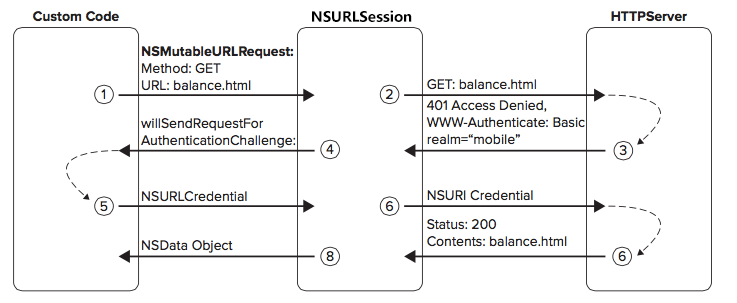

#HTTP/HTTPS授权访问（一）
##背景
在http请求中某些url访问需要具有权限认证,否则会返回401错误码,这时需要你在请求头中附带授权的用户名,密码;或者使用https协议第一次与服务端建立连接的时候,服务端会发送iOS客户端一个证书，这时我们需要验证服务端证书链(certificate keychain)。
当我们遇到以上情况的时候NSURLSession(在iOS7以后网络请求全部由NSURLSession来完成所以在此以NSURLSession为例)中的一个delegate会被调用:

```objective-c
 - (void)URLSession:(NSURLSession *)session
              task:(NSURLSessionTask *)task
didReceiveChallenge:(NSURLAuthenticationChallenge *)challenge
 completionHandler:(void (^)(NSURLSessionAuthChallengeDisposition disposition, NSURLCredential *credential))completionHandler
```
这个代理就是为了处理从服务端传回的`NSURLAuthenticationChallenge`(认证),在`NSURLAuthenticationChallenge`的protectionSpace中存放了服务端返回的认证信息,我们需要根据这些信息来创建对应的`NSURLCredential `(证书/凭证),并且设置对应的`NSURLSessionAuthChallengeDisposition`(处理方式)来告诉NSURLSession来如何处理处服务端返回的个认证.

在`NSURLSessionAuthChallengeDisposition`中包含三种类型

```objective-c
 NSURLSessionAuthChallengePerformDefaultHandling：默认方式处理
 NSURLSessionAuthChallengeUseCredential：使用指定的证书
 NSURLSessionAuthChallengeCancelAuthenticationChallenge：取消
```

AFNetworking在代理中做了如下处理:

```objective-c
    NSURLSessionAuthChallengeDisposition disposition = NSURLSessionAuthChallengePerformDefaultHandling;
    __block NSURLCredential *credential = nil;

    if (self.sessionDidReceiveAuthenticationChallenge)
    {   // 自定义认证方式
        disposition = self.sessionDidReceiveAuthenticationChallenge(session, challenge, &credential);
    }
    else
    {   // 默认处理方式
        // 判断从服务返回的受保护空间中拿到证书的类型是是否是服务器信任的
        if ([challenge.protectionSpace.authenticationMethod isEqualToString:NSURLAuthenticationMethodServerTrust])
        {
            // AFSecurityPolicy 根据默认规则判断是否需要新建证书
            if ([self.securityPolicy evaluateServerTrust:challenge.protectionSpace.serverTrust forDomain:challenge.protectionSpace.host])
            {
                credential = [NSURLCredential credentialForTrust:challenge.protectionSpace.serverTrust]; // 根据服务器返回的challenge中的protectionSpace中的SecTrustRefwww创建证书
                if (credential) {
                    disposition = NSURLSessionAuthChallengeUseCredential; // 使用创建的证书
                } else {
                    disposition = NSURLSessionAuthChallengePerformDefaultHandling; //使用默认方式
                }
            }
            else
            {
                disposition = NSURLSessionAuthChallengeCancelAuthenticationChallenge;
            }
        }
        else
        {
            disposition = NSURLSessionAuthChallengePerformDefaultHandling;
        }
    }

    if (completionHandler) {
        completionHandler(disposition, credential);
    }
```
这个方法具体做了什么会在后面的文章中写出,本文主要介绍的是`NSURLCredential`与`NSURLAuthenticationChallenge`.
###NSURLCredential
在这个代理中是一个用来提供用户和密码，或者是信任服务器证书凭证的证书类,主要有一下三种创建方式:

1.通过用户名,密码来创建证书,一般用于401错误的认证,或者其他需要用户名密码的认证

```objective-c
	- (instancetype)initWithUser:(NSString *)user password:(NSString *)password persistence:(NSURLCredentialPersistence)persistence;
```

2.通过从钥匙串中取得一个客户端证书来创建证书,一般用于服务端要认证客户端的情况

```objective-c
	- (instancetype)initWithIdentity:(SecIdentityRef)identity certificates:(nullable NSArray *)certArray persistence:(NSURLCredentialPersistence)persistence
```

3.通过服务端传回的SecTrustRef(包含待验证的证书和支持的验证方法等。)对象创建证书,一般用于客户端需要验证服务端身份时使用

```objective-c
-(id)initWithTrust:(SecTrustRef)trust
```

你会发现前两个构造方法中都有一个NSURLCredentialPersistence参数,这个参数一共含有三种类型

-	NSURLCredentialPersistenceNone 不保存,只请求一次
-  NSURLCredentialPersistenceForSession 只在本次会话中有效
-  NSURLCredentialPersistencePermanent 永久有效,保存在钥匙串中

###NSURLProtectionSpace

在介绍`NSURLAuthenticationChallenge `之前先说一下NSURLAuthenticationChallenge中的一个属性`NSURLProtectionSpace `这是权限认证的核心,它通常被称为保护空间,代表了服务器上的一块需要授权信息的区域。包括了服务器地址、端口等信息.这个保护空间含有以下几个信息:
 
```objective-c
- (NSString *)realm; // 用于定义保护的区域,在服务端可以通过 realm 将不同的资源分成不同的域，域的名称即为 realm 的值，每个域可能会有自己的权限鉴别方案。
- (BOOL)receivesCredentialSecurely; // 这个空间内的证书是否能够安全的发送
- (BOOL)isProxy; // 代理授权
- (NSString *)host; // 服务端主机地址，如果是代理则代理服务器地址
- (NSInteger)port; // 服务端端口地址，如果是代理则代理服务器的端口
- (NSString *)proxyType; // 代理类型，只对代理授权，比如http代理，socket代理等。
- (NSString *)protocol; // 使用的协议，比如http,https, ftp等，
- (NSString *)authenticationMethod; // 指定授权方式，比如401，客户端认证，服务端信任，代理等。
- (NSArray *)distinguishedNames; // 可接受的颁发机关客户端证书身份验证
- (SecTrustRef)serverTrust; // 用于服务端信任，指定一个信任对象,可以用这个对象来建立一个凭证。
``` 
其中authenticationMethod中包含的认证类型如下:

```objective-c
NSURLProtectionSpaceHTTP // http协议
NSURLProtectionSpaceHTTPS // https协议
NSURLProtectionSpaceFTP // ftp协议
NSURLProtectionSpaceHTTPProxy // http代理
NSURLProtectionSpaceHTTPSProxy // https代理
NSURLProtectionSpaceFTPProxy // ftp代理
NSURLProtectionSpaceSOCKSProxy // socks代理
NSURLAuthenticationMethodDefault // 协议的默认身份认证
NSURLAuthenticationMethodHTTPBasic // http的basic认证,等同于NSURLAuthenticationMethodDefault
NSURLAuthenticationMethodHTTPDigest // http的摘要认证
NSURLAuthenticationMethodHTMLForm // html的表单认证
适用于任何协议
NSURLAuthenticationMethodNTLM // NTLM认证
NSURLAuthenticationMethodNegotiate // Negotiate认证
NSURLAuthenticationMethodClientCertificate // ssl证书认证,适用于任何协议
NSURLAuthenticationMethodServerTrust // ServerTrust认证,适用于任何协议
```

接下来就是`NSURLAuthenticationChallenge `类
###NSURLAuthenticationChallenge

这是由服务端返回的权限认证类，中间包含如下信息:

```objective-c
- (NSURLProtectionSpace *)protectionSpace; // 这个函数返回一个类NSURLProtectionSpace，类中描述服务器中希望的认证方式以及协议，主机端口号等信息。
- (NSURLCredential *)proposedCredential; // 建议使用的证书
- (NSInteger)previousFailureCount; // 用户密码输入失败的次数。
- (NSURLResponse *)failureResponse; // 授权失败的响应头的详细信息
- (NSError *)error; // 最后一次授权失败的错误信息
```

我们可以大致梳理下整体流程:



当客户端发出一个网络请求的时候(图中的第1,2步),服务端会收到来自客户端的请求并作出响应(图中的第3步),这里服务端发现此请求需要输入用户名才能继续,所以客户端返回了一个权限认证,这是客户端中的NSURLSession的delegate会被调用,这时我们可以从challenge中的protectionSpace里的authenticationMethod属性获取到当前服务器需要我们提供什么类型的认证 (在图中authenticationMethod为NSURLAuthenticationMethodHTTPDigest) ,根据不同的类型使用不同的方式创建需要处理的credential然后设置对应的disposition参数,然后通过completionHandler告诉Session如何处理此次的权限认证(其实最后最后session会将此凭证返回给服务端,再由服务端去校验输入用户名密码是否正确,如果正确便继续请求,如果不正确的话会继续返回认证).

##结语
其实本文除了介绍`NSURLCredential`与`NSURLAuthenticationChallenge`外还大致讲述了在http请求中的NSURLAuthenticationMethodHTTPDigest(摘要认证)认证的大致流程,在下一篇文章中会着重讲述下https请求中的验证以及客户端的校验过程。

参考博文:
<http://blog.csdn.net/wangyangzhizhou/article/details/51336038?utm_source=tuicool&utm_medium=referral>
<http://blog.csdn.net/u014084081/article/details/53610157>
<http://www.cnblogs.com/eileenleung/p/5237682.html>
<http://www.jianshu.com/p/4b5d2d47833d>